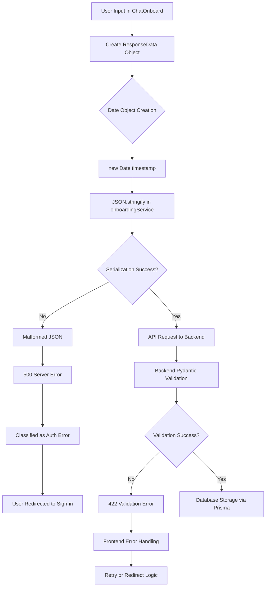

# Frontend Data Serialization Issues Analysis

## Overview

This document provides a comprehensive analysis of frontend data serialization problems in the Orientor onboarding system, focusing on the data flow inconsistencies, type mismatches, and serialization failures that have been causing authentication redirects and API communication failures.

## Critical Issues Identified

### 1. Date Serialization Mismatch

#### Issue Description
The frontend creates Date objects that fail JSON serialization when sent to the backend, causing API call failures that trigger authentication redirects.

#### Location: `ChatOnboard.tsx:194-199`
```typescript
// PROBLEMATIC: Creating Date objects that fail JSON.stringify()
const responseData = {
  questionId: currentQuestion.id,
  question: currentQuestion.text,
  response: inputValue.trim(),
  timestamp: new Date()  // ⚠️ SERIALIZATION ISSUE
};
```

#### Backend Expected Format: `onboarding.py:54-58`
```python
class OnboardingResponse(BaseModel):
    questionId: str
    question: str
    response: str
    timestamp: Optional[datetime] = None  # Backend expects ISO string or null
```

#### Serialization Flow Problem
1. **Frontend Creation**: `new Date()` creates Date object
2. **JSON.stringify()**: Converts Date to ISO string (correct)
3. **Backend Parsing**: Expects `Optional[datetime]` but validation may fail
4. **Network Error**: 500 error triggers authentication redirect instead of data error

### 2. TypeScript Interface Conflicts

#### Frontend Types (`types/onboarding.ts:8-13`)
```typescript
export interface OnboardingResponse {
  questionId: string;
  question: string;
  response: string;
  timestamp: Date;  // ⚠️ Frontend expects Date object
}
```

#### Backend Schema (`onboarding.py:54-58`)
```python
class OnboardingResponse(BaseModel):
    questionId: str
    question: str
    response: str
    timestamp: Optional[datetime] = None  # Optional field, can be null
```

#### Type Safety Gap
- Frontend interface enforces Date objects
- Backend accepts optional datetime strings
- No runtime type checking between layers
- Silent type coercion failures

### 3. API Service Data Flow Issues

#### Inconsistent Request Formatting

**Location: `onboardingService.ts:193-204`**
```typescript
saveResponse: async (responseData: OnboardingResponse): Promise<OnboardingProgressResponse> => {
  try {
    const token = await checkAuth();
    const response = await clerkApiService.request('/api/v1/onboarding/response', {
      method: 'POST',
      body: JSON.stringify(responseData),  // ⚠️ Date serialization issue here
      token
    }) as OnboardingProgressResponse;
    return response;
  } catch (error) {
    throw createError(error, 'save response');
  }
},
```

**Problem Areas:**
1. No pre-serialization data transformation
2. Direct JSON.stringify() on objects with Date fields
3. Error handling treats serialization failures as auth errors

#### Mixed Serialization Approaches

**Location: `onboardingService.ts:207-227`**
```typescript
completeOnboarding: async (data: {
  responses: OnboardingResponse[];
  psychProfile?: PsychProfile;
}): Promise<OnboardingCompleteResponse> => {
  try {
    console.log('Sending onboarding completion data:', {
      responses: data.responses.length,
      psychProfile: data.psychProfile ? 'Present' : 'Missing',
      data: data  // ⚠️ Raw data with potential Date serialization issues
    });
    const token = await checkAuth();
    const response = await clerkApiService.request('/api/v1/onboarding/complete', {
      method: 'POST',
      body: JSON.stringify(data),  // ⚠️ No transformation applied
      token
    }) as OnboardingCompleteResponse;
    return response;
  }
}
```

### 4. Error Handling Weaknesses

#### Misleading Error Classification

**Location: `onboardingService.ts:67-102`**
```typescript
const createError = (error: any, operation: string): OnboardingError => {
  console.error(`Onboarding ${operation} error:`, error);
  
  if (error?.response?.status === 401 || error?.message?.includes('401')) {
    return new OnboardingError(`Authentication failed during ${operation}`, {
      type: 'auth',
      message: 'Please sign in again',
      code: 'AUTH_REQUIRED',
      retryable: false
    });
  }
  
  if (error?.response?.status === 500 || error?.message?.includes('500')) {
    return new OnboardingError(`Server error during ${operation}`, {
      type: 'server',
      message: 'Server encountered an error. Please try again.',
      code: 'SERVER_ERROR',
      retryable: true  // ⚠️ Serialization errors marked as retryable
    });
  }
```

**Issues:**
- 500 errors (including serialization failures) classified as generic server errors
- No specific handling for data serialization issues
- Retryable flag set incorrectly for data structure problems

## Recent Breaking Changes Analysis

### Prisma ORM Migration Impact

**Commit: `b5f45bd` - Complete Prisma ORM Migration**

The recent Prisma migration introduced stricter type validation that exposed existing serialization issues:

#### Backend Changes (`onboarding.py:261-307`)
```python
@router.post("/onboarding/complete")
async def complete_onboarding(
    onboarding_data: OnboardingData,  # Stricter validation now
    current_user: User = Depends(get_current_user_with_onboarding),
    db: Prisma = Depends(get_prisma_client)
):
    # Enhanced error handling and validation
    try:
        # More strict data validation with Prisma
        if onboarding_data.responses:
            for response_data in onboarding_data.responses:
                # Prisma validates datetime fields more strictly
                personality_response = await db.personality_responses.create(
                    data={
                        'assessment_id': assessment.id,
                        'item_id': response_data.questionId,
                        'item_type': 'open_ended',
                        'response_value': {
                            'question': response_data.question,
                            'response': response_data.response
                        },
                        'created_at': datetime.utcnow()  # Server-side datetime creation
                    }
                )
```

### Working vs Broken Data Flow Patterns

#### Working Pattern (Backend-Generated Timestamps)
```python
# Backend creates timestamps
'created_at': datetime.utcnow()
```

#### Broken Pattern (Frontend Date Objects)
```typescript
// Frontend creates Date objects that may not serialize properly
timestamp: new Date()
```

## Complete Data Flow Diagram



## Type Definition Mismatches

### Frontend Interface Structure
```typescript
// frontend/src/types/onboarding.ts
export interface OnboardingResponse {
  questionId: string;     // ✅ Matches
  question: string;       // ✅ Matches  
  response: string;       // ✅ Matches
  timestamp: Date;        // ⚠️ Type mismatch
}

export interface PsychProfile {
  hexaco: Partial<HEXACODimension>;      // ⚠️ Partial vs complete
  riasec: Partial<RIASECDimension>;      // ⚠️ Partial vs complete
  topTraits: string[];                   // ✅ Matches
  description: string;                   // ✅ Matches
}
```

### Backend Pydantic Models
```python
# backend/app/routers/onboarding.py
class OnboardingResponse(BaseModel):
    questionId: str                        # ✅ Matches
    question: str                          # ✅ Matches
    response: str                          # ✅ Matches
    timestamp: Optional[datetime] = None   # ⚠️ Optional, expects ISO string

class OnboardingData(BaseModel):
    responses: List[OnboardingResponse] = []     # ✅ Matches but defaults to empty
    psychProfile: Optional[Dict[str, Any]] = None  # ⚠️ Generic dict vs typed interface
```

## API Service Data Transformation Examples

### Current Broken Flow

**File: `ChatOnboard.tsx:194-210`**
```typescript
// 1. Create data with Date object
const responseData = {
  questionId: currentQuestion.id,
  question: currentQuestion.text,
  response: inputValue.trim(),
  timestamp: new Date()  // ⚠️ Will serialize to ISO string but may fail validation
};

// 2. Add to store (works locally)
addResponse(responseData);

// 3. Save to API (fails here)
try {
  await saveResponseToAPI(onboardingService, responseData);
} catch (error) {
  console.error('Failed to save response to API:', error);
  // Continue with local flow even if API save fails
}
```

**File: `onboardingService.ts:193-204`**
```typescript
saveResponse: async (responseData: OnboardingResponse): Promise<OnboardingProgressResponse> => {
  try {
    const token = await checkAuth();
    const response = await clerkApiService.request('/api/v1/onboarding/response', {
      method: 'POST',
      body: JSON.stringify(responseData),  // Date → ISO string conversion here
      token
    }) as OnboardingProgressResponse;
    return response;
  } catch (error) {
    throw createError(error, 'save response');  // Misclassifies serialization errors
  }
},
```

### Required Fix Pattern

```typescript
// Transform data before serialization
const transformForAPI = (data: OnboardingResponse) => ({
  ...data,
  timestamp: data.timestamp?.toISOString() || null  // Explicit transformation
});

// In saveResponse method
body: JSON.stringify(transformForAPI(responseData))
```

## Specific File References and Line Numbers

### Primary Issue Locations

1. **Date Object Creation**: `/frontend/src/components/onboarding/ChatOnboard.tsx:198`
2. **Type Interface Mismatch**: `/frontend/src/types/onboarding.ts:12`
3. **Direct JSON Serialization**: `/frontend/src/services/onboardingService.ts:198`
4. **Error Misclassification**: `/frontend/src/services/onboardingService.ts:79`
5. **Backend Validation**: `/backend/app/routers/onboarding.py:58`

### Secondary Issue Locations

1. **Store Management**: `/frontend/src/stores/onboardingStore.ts:150-157`
2. **API Service**: `/frontend/src/services/api.ts:125`
3. **Validation Utilities**: `/frontend/src/utils/validation.ts:184-199`

## Impact Assessment

### User Experience Impact
- Users experience unexpected redirects to sign-in page
- Onboarding progress lost due to API failures
- Confusion between authentication and data errors

### Technical Debt Impact
- Mixed serialization patterns across components
- Type safety violations between frontend and backend
- Error handling that obscures root causes

### Performance Impact
- Failed API calls cause retry loops
- Authentication token refreshes triggered unnecessarily
- Database transactions rolled back due to validation failures

## Recommended Fix Priority

1. **Critical**: Fix Date serialization in `ChatOnboard.tsx`
2. **High**: Update TypeScript interfaces to match backend schemas
3. **Medium**: Implement proper data transformation in API services
4. **Low**: Enhance error classification to distinguish data vs auth errors

This analysis provides the foundation for implementing targeted fixes to resolve the serialization issues causing the onboarding system failures.