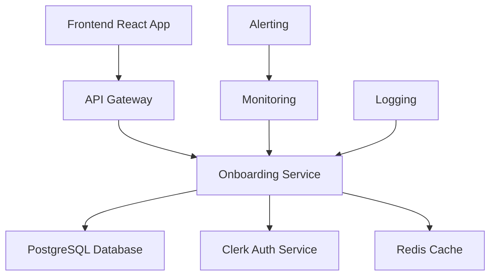

# Onboarding System Maintenance and Operations Guide

## Executive Summary

This document provides comprehensive maintenance procedures, debugging workflows, and operational guidelines for the Orientor Platform's onboarding system. It serves as the primary reference for operations teams to maintain system health, troubleshoot issues, and ensure optimal performance.

## Daily Operations Procedures

### 1. Health Check Commands and Scripts

#### 1.1 System Health Validation

Create a daily health check script that can be automated:

```bash
#!/bin/bash
# File: scripts/onboarding-health-check.sh

set -e

echo "🔍 Onboarding System Health Check - $(date)"
echo "=================================================="

# Test database connectivity
echo "1. Database Connectivity..."
cd backend
python3 -c "
import asyncio
from app.utils.prisma_client import get_prisma_client

async def test_db():
    prisma = get_prisma_client()
    try:
        await prisma.connect()
        user_count = await prisma.user.count()
        assessment_count = await prisma.personality_assessments.count()
        profile_count = await prisma.personalityprofile.count()
        
        print(f'   ✅ Database connected')
        print(f'   📊 Users: {user_count}')
        print(f'   📝 Assessments: {assessment_count}')
        print(f'   🧠 Profiles: {profile_count}')
        
        await prisma.disconnect()
        return True
    except Exception as e:
        print(f'   ❌ Database error: {e}')
        return False

result = asyncio.run(test_db())
exit(0 if result else 1)
"

# Test API endpoints
echo "2. API Endpoint Health..."
cd ..
curl -f -s http://localhost:8000/health > /dev/null && echo "   ✅ API server responding" || echo "   ❌ API server not responding"

# Test Clerk authentication
echo "3. Authentication Service..."
cd backend
python3 -c "
from app.utils.clerk_auth import clerk_health_check
import asyncio

result = asyncio.run(clerk_health_check())
print(f'   ✅ Clerk auth: {\"OK\" if result else \"FAILED\"}')
"

# Check error rates in logs
echo "4. Error Rate Analysis..."
if [ -f logs/app.log ]; then
    error_count=$(grep -c "ERROR" logs/app.log 2>/dev/null || echo "0")
    warning_count=$(grep -c "WARNING" logs/app.log 2>/dev/null || echo "0")
    echo "   📊 Last 24h errors: $error_count"
    echo "   ⚠️  Last 24h warnings: $warning_count"
    
    if [ "$error_count" -gt 100 ]; then
        echo "   🚨 HIGH ERROR RATE - Investigation required"
    fi
else
    echo "   ℹ️  No log file found"
fi

# Check onboarding completion rate
echo "5. Onboarding Metrics..."
cd backend
python3 -c "
import asyncio
from app.utils.prisma_client import get_prisma_client

async def check_metrics():
    prisma = get_prisma_client()
    try:
        await prisma.connect()
        
        total_users = await prisma.user.count()
        completed_users = await prisma.user.count(where={'onboarding_completed': True})
        
        if total_users > 0:
            completion_rate = (completed_users / total_users) * 100
            print(f'   📊 Completion rate: {completion_rate:.1f}% ({completed_users}/{total_users})')
            
            if completion_rate < 50:
                print('   🚨 LOW COMPLETION RATE - Investigation required')
            elif completion_rate < 70:
                print('   ⚠️  MODERATE COMPLETION RATE - Monitor closely')
            else:
                print('   ✅ HEALTHY COMPLETION RATE')
        else:
            print('   ℹ️  No users in system yet')
            
        await prisma.disconnect()
    except Exception as e:
        print(f'   ❌ Metrics check failed: {e}')

asyncio.run(check_metrics())
"

echo "=================================================="
echo "✅ Health check completed - $(date)"
```

Make the script executable:
```bash
chmod +x scripts/onboarding-health-check.sh
```

#### 1.2 Automated Health Monitoring

Create a cron job for automated daily checks:

```bash
# Add to crontab (crontab -e)
0 8 * * * cd /path/to/orientor && ./scripts/onboarding-health-check.sh >> logs/health-check.log 2>&1
```

#### 1.3 Performance Baseline Monitoring

Create performance monitoring script:

```bash
#!/bin/bash
# File: scripts/performance-monitor.sh

echo "⚡ Performance Monitoring - $(date)"
echo "================================="

cd backend

# Database query performance
python3 -c "
import asyncio
import time
import statistics
from app.utils.prisma_client import get_prisma_client

async def measure_performance():
    prisma = get_prisma_client()
    await prisma.connect()
    
    try:
        # Test user queries
        times = []
        for i in range(5):
            start = time.time()
            await prisma.user.find_many(take=10)
            times.append((time.time() - start) * 1000)
        
        avg_time = statistics.mean(times)
        print(f'User queries: {avg_time:.2f}ms avg')
        
        # Test assessment queries
        times = []
        for i in range(5):
            start = time.time()
            await prisma.personality_assessments.find_many(take=10)
            times.append((time.time() - start) * 1000)
        
        avg_time = statistics.mean(times)
        print(f'Assessment queries: {avg_time:.2f}ms avg')
        
        if avg_time > 500:
            print('🚨 SLOW QUERIES - Optimization needed')
        elif avg_time > 200:
            print('⚠️  MODERATE PERFORMANCE - Monitor closely')
        else:
            print('✅ GOOD PERFORMANCE')
            
    except Exception as e:
        print(f'❌ Performance test failed: {e}')
    finally:
        await prisma.disconnect()

asyncio.run(measure_performance())
"

# API response time test
echo "API Response Times:"
for endpoint in "/health" "/api/onboarding/status"; do
    response_time=$(curl -w "%{time_total}" -s -o /dev/null http://localhost:8000$endpoint)
    echo "  $endpoint: ${response_time}s"
done
```

### 2. Monitoring Dashboards and Alerts

#### 2.1 Prometheus Metrics Configuration

Create metrics collection for monitoring:

```python
# File: backend/app/monitoring/metrics.py
from prometheus_client import Counter, Histogram, Gauge
import time
from functools import wraps

# Metrics definitions
onboarding_attempts = Counter('onboarding_attempts_total', 'Total onboarding attempts')
onboarding_completions = Counter('onboarding_completions_total', 'Total onboarding completions')
onboarding_errors = Counter('onboarding_errors_total', 'Total onboarding errors', ['error_type'])
onboarding_duration = Histogram('onboarding_duration_seconds', 'Time to complete onboarding')
active_assessments = Gauge('active_assessments', 'Current active assessments')

# Database operation metrics
db_operations = Counter('database_operations_total', 'Total database operations', ['operation', 'status'])
db_query_duration = Histogram('database_query_duration_seconds', 'Database query duration', ['operation'])

def track_onboarding_metrics(operation):
    """Decorator to track onboarding metrics"""
    def decorator(func):
        @wraps(func)
        async def wrapper(*args, **kwargs):
            start_time = time.time()
            
            try:
                result = await func(*args, **kwargs)
                
                if operation == 'start':
                    onboarding_attempts.inc()
                elif operation == 'complete':
                    onboarding_completions.inc()
                    onboarding_duration.observe(time.time() - start_time)
                    
                db_operations.labels(operation=operation, status='success').inc()
                return result
                
            except Exception as e:
                onboarding_errors.labels(error_type=type(e).__name__).inc()
                db_operations.labels(operation=operation, status='error').inc()
                raise
            finally:
                db_query_duration.labels(operation=operation).observe(time.time() - start_time)
                
        return wrapper
    return decorator
```

#### 2.2 Grafana Dashboard Configuration

Create Grafana dashboard JSON configuration:

```json
{
  "dashboard": {
    "title": "Onboarding System Monitoring",
    "panels": [
      {
        "title": "Onboarding Completion Rate",
        "type": "stat",
        "targets": [
          {
            "expr": "rate(onboarding_completions_total[5m]) / rate(onboarding_attempts_total[5m]) * 100"
          }
        ]
      },
      {
        "title": "Active Assessments",
        "type": "stat",
        "targets": [
          {
            "expr": "active_assessments"
          }
        ]
      },
      {
        "title": "Error Rate",
        "type": "graph",
        "targets": [
          {
            "expr": "rate(onboarding_errors_total[5m])"
          }
        ]
      },
      {
        "title": "Response Times",
        "type": "graph",
        "targets": [
          {
            "expr": "histogram_quantile(0.95, rate(database_query_duration_seconds_bucket[5m]))"
          }
        ]
      }
    ]
  }
}
```

#### 2.3 Alert Rules

Create alerting rules file:

```yaml
# File: monitoring/alert-rules.yml
groups:
  - name: onboarding_alerts
    rules:
      - alert: HighOnboardingErrorRate
        expr: rate(onboarding_errors_total[5m]) > 0.1
        for: 5m
        labels:
          severity: critical
        annotations:
          summary: "High onboarding error rate detected"
          description: "Onboarding error rate is {{ $value }} errors per second"

      - alert: LowCompletionRate
        expr: rate(onboarding_completions_total[1h]) / rate(onboarding_attempts_total[1h]) < 0.5
        for: 15m
        labels:
          severity: warning
        annotations:
          summary: "Low onboarding completion rate"
          description: "Only {{ $value }}% of users are completing onboarding"

      - alert: DatabaseSlowQueries
        expr: histogram_quantile(0.95, rate(database_query_duration_seconds_bucket[5m])) > 1.0
        for: 10m
        labels:
          severity: warning
        annotations:
          summary: "Slow database queries detected"
          description: "95th percentile query time is {{ $value }} seconds"

      - alert: OnboardingSystemDown
        expr: up{job="onboarding-api"} == 0
        for: 1m
        labels:
          severity: critical
        annotations:
          summary: "Onboarding system is down"
          description: "The onboarding API is not responding"
```

### 3. Automated System Validation Routines

#### 3.1 Integration Test Suite

Create automated integration test runner:

```bash
#!/bin/bash
# File: scripts/integration-test-runner.sh

set -e

echo "🧪 Running Onboarding Integration Tests"
echo "======================================"

cd backend

# Run specific onboarding tests
echo "1. Backend API Tests..."
python -m pytest tests/test_onboarding_integration.py -v --tb=short

echo "2. Database Integration Tests..."
python -m pytest tests/test_database_integration.py -v --tb=short

echo "3. Authentication Integration Tests..."
python -m pytest tests/test_auth_integration.py -v --tb=short

# Frontend tests
echo "4. Frontend Component Tests..."
cd ../frontend
npm test -- --watchAll=false --testPathPattern=onboarding

# E2E tests
echo "5. End-to-End Flow Tests..."
npm run test:e2e -- --grep="onboarding"

echo "✅ All integration tests completed"
```

#### 3.2 Data Integrity Validation

Create data validation script:

```python
# File: scripts/validate-data-integrity.py
"""
Data integrity validation for onboarding system
"""
import asyncio
from datetime import datetime, timedelta
from backend.app.utils.prisma_client import get_prisma_client

async def validate_data_integrity():
    """Validate data integrity across onboarding tables"""
    prisma = get_prisma_client()
    await prisma.connect()
    
    try:
        print("🔍 Data Integrity Validation")
        print("============================")
        
        # Check for orphaned records
        print("1. Checking for orphaned assessments...")
        orphaned_assessments = await prisma.personality_assessments.find_many(
            where={
                'user': None
            }
        )
        if orphaned_assessments:
            print(f"   ⚠️  Found {len(orphaned_assessments)} orphaned assessments")
        else:
            print("   ✅ No orphaned assessments found")
        
        # Check for orphaned responses
        print("2. Checking for orphaned responses...")
        orphaned_responses = await prisma.personality_responses.find_many(
            where={
                'assessment': None
            }
        )
        if orphaned_responses:
            print(f"   ⚠️  Found {len(orphaned_responses)} orphaned responses")
        else:
            print("   ✅ No orphaned responses found")
        
        # Check for incomplete assessments
        print("3. Checking for stale incomplete assessments...")
        cutoff_date = datetime.now() - timedelta(days=7)
        stale_assessments = await prisma.personality_assessments.find_many(
            where={
                'status': 'in_progress',
                'created_at': {
                    'lt': cutoff_date
                }
            }
        )
        if stale_assessments:
            print(f"   ⚠️  Found {len(stale_assessments)} stale assessments")
            for assessment in stale_assessments:
                print(f"      Assessment {assessment.id} from {assessment.created_at}")
        else:
            print("   ✅ No stale assessments found")
        
        # Check for users with profiles but no completed onboarding
        print("4. Checking for data inconsistencies...")
        users_with_profiles = await prisma.user.find_many(
            where={
                'onboarding_completed': False,
                'personalityprofile': {
                    'some': {}
                }
            },
            include={'personalityprofile': True}
        )
        if users_with_profiles:
            print(f"   ⚠️  Found {len(users_with_profiles)} users with profiles but onboarding not marked complete")
        else:
            print("   ✅ No data inconsistencies found")
            
        # Summary
        total_issues = len(orphaned_assessments) + len(orphaned_responses) + len(stale_assessments) + len(users_with_profiles)
        if total_issues == 0:
            print("\n✅ Data integrity check passed - no issues found")
        else:
            print(f"\n⚠️  Data integrity check found {total_issues} issues that may need attention")
            
    except Exception as e:
        print(f"❌ Data integrity check failed: {e}")
    finally:
        await prisma.disconnect()

if __name__ == '__main__':
    asyncio.run(validate_data_integrity())
```

## Troubleshooting Playbook

### 1. Common Error Scenarios with Step-by-Step Resolution

#### 1.1 Database Connection Failures

**Symptoms:**
- API returns 503 Service Unavailable
- Logs show "ClientNotConnectedError"
- Health checks fail on database connectivity

**Resolution Steps:**

```bash
# Step 1: Check database server status
pg_isready -h $DB_HOST -p $DB_PORT -U $DB_USER

# Step 2: Test connection with psql
psql $DATABASE_URL -c "SELECT 1;"

# Step 3: Check Prisma connection
cd backend
python3 -c "
import asyncio
from app.utils.prisma_client import get_prisma_client

async def test():
    prisma = get_prisma_client()
    try:
        await prisma.connect()
        print('✅ Connection successful')
        await prisma.disconnect()
    except Exception as e:
        print(f'❌ Connection failed: {e}')

asyncio.run(test())
"

# Step 4: Restart Prisma client if needed
cd backend
npx prisma generate
python3 -c "from app.utils.prisma_client import reset_prisma_client; reset_prisma_client()"

# Step 5: Restart application servers
pm2 restart all
```

**Escalation:** If database server is down, contact infrastructure team immediately.

#### 1.2 Authentication Failures

**Symptoms:**
- Users cannot start onboarding
- 401 Unauthorized responses
- Clerk token validation failures

**Resolution Steps:**

```bash
# Step 1: Check Clerk service status
curl -H "Authorization: Bearer $CLERK_SECRET_KEY" \
     https://api.clerk.dev/v1/health

# Step 2: Validate JWKS endpoint
cd backend
python3 -c "
import asyncio
from app.utils.clerk_auth import fetch_clerk_jwks

async def test():
    try:
        jwks = await fetch_clerk_jwks()
        print(f'✅ JWKS fetched: {len(jwks.get(\"keys\", []))} keys')
    except Exception as e:
        print(f'❌ JWKS fetch failed: {e}')

asyncio.run(test())
"

# Step 3: Clear auth cache
cd backend
python3 -c "
from app.utils.clerk_auth import CLERK_JWKS_CACHE
CLERK_JWKS_CACHE.clear()
print('✅ Auth cache cleared')
"

# Step 4: Test token validation
# (Use actual user token for testing)
cd backend
python3 -c "
import asyncio
from app.utils.clerk_auth import verify_clerk_token

async def test():
    try:
        # Replace with actual test token
        token = 'test-token-here'
        payload = await verify_clerk_token(token)
        print(f'✅ Token valid: {payload}')
    except Exception as e:
        print(f'❌ Token invalid: {e}')

# Only run if you have a test token
# asyncio.run(test())
"

# Step 5: Restart services
pm2 restart onboarding-api
```

**Escalation:** If Clerk service is down, check Clerk status page and contact Clerk support.

#### 1.3 Prisma Schema Inconsistencies

**Symptoms:**
- "Table does not exist" errors
- Schema drift warnings
- Migration failures

**Resolution Steps:**

```bash
# Step 1: Check schema status
cd backend
npx prisma db pull
git diff prisma/schema.prisma

# Step 2: Validate current schema against database
npx prisma validate

# Step 3: Generate and review migration
npx prisma migrate dev --create-only --name schema-fix

# Step 4: Review migration file before applying
ls prisma/migrations/ | tail -1
cat prisma/migrations/*/migration.sql

# Step 5: Apply migration if safe
npx prisma migrate dev

# Step 6: Regenerate client
npx prisma generate

# Step 7: Restart application
pm2 restart all
```

**Escalation:** For production environments, create database backup before applying migrations.

#### 1.4 Frontend Serialization Errors

**Symptoms:**
- Console errors about non-serializable data
- Onboarding completion callbacks fail
- State management issues

**Resolution Steps:**

```bash
# Step 1: Check browser console for specific errors
echo "Check browser console for serialization errors"

# Step 2: Validate TypeScript compilation
cd frontend
npm run typecheck

# Step 3: Check for non-serializable objects in state
echo "Look for Date objects, functions, or class instances in onboarding responses"

# Step 4: Apply serialization fix
# Edit ChatOnboard.tsx to serialize responses before callbacks
sed -i.bak 's/onComplete?.(responses)/onComplete?.(responses.map(r => ({ ...r, timestamp: r.timestamp?.toISOString() })))/g' src/components/onboarding/ChatOnboard.tsx

# Step 5: Rebuild and test
npm run build
npm run dev
```

**Escalation:** Check with frontend team if serialization patterns need system-wide updates.

### 2. Emergency Response Procedures for System Failures

#### 2.1 Complete System Outage

**Immediate Response (0-5 minutes):**

```bash
#!/bin/bash
# Emergency response script

echo "🚨 EMERGENCY RESPONSE ACTIVATED"
echo "Current time: $(date)"

# Step 1: Check all services
echo "1. Service Status Check:"
pm2 status

# Step 2: Check database connectivity
echo "2. Database Status:"
pg_isready -h $DB_HOST -p $DB_PORT

# Step 3: Attempt service restart
echo "3. Restarting services..."
pm2 restart all

# Step 4: Quick health check
sleep 10
curl -f http://localhost:8000/health && echo "✅ API recovered" || echo "❌ API still down"

# Step 5: Alert team
echo "4. Sending alerts..."
# Add your alerting mechanism here (Slack, PagerDuty, etc.)

echo "Emergency response completed at: $(date)"
```

#### 2.2 Database Corruption Recovery

**Immediate Actions:**

```bash
# Step 1: Stop all services to prevent further corruption
pm2 stop all

# Step 2: Create immediate backup of current state
pg_dump $DATABASE_URL > emergency_backup_$(date +%Y%m%d_%H%M%S).sql

# Step 3: Check database integrity
psql $DATABASE_URL -c "
SELECT schemaname, tablename, attname, n_distinct, correlation 
FROM pg_stats 
WHERE tablename IN ('users', 'personality_assessments', 'personalityprofile');
"

# Step 4: Run database repair if needed
psql $DATABASE_URL -c "REINDEX DATABASE $(echo $DATABASE_URL | sed 's/.*\///');"

# Step 5: Validate data integrity
cd backend
python scripts/validate-data-integrity.py

# Step 6: If corruption is severe, restore from backup
# pg_restore -d $DATABASE_URL backup_file.sql

# Step 7: Restart services
pm2 start all
```

#### 2.3 High Error Rate Response

**Automated Response (when error rate exceeds threshold):**

```bash
#!/bin/bash
# High error rate response

ERROR_THRESHOLD=50
CURRENT_ERRORS=$(grep -c "ERROR" backend/logs/app.log | tail -100)

if [ "$CURRENT_ERRORS" -gt "$ERROR_THRESHOLD" ]; then
    echo "🚨 High error rate detected: $CURRENT_ERRORS errors"
    
    # Capture current logs
    tail -1000 backend/logs/app.log > emergency_logs_$(date +%Y%m%d_%H%M%S).log
    
    # Check for common error patterns
    echo "Top error patterns:"
    grep "ERROR" backend/logs/app.log | awk '{print $NF}' | sort | uniq -c | sort -nr | head -5
    
    # Restart services if authentication errors dominate
    AUTH_ERRORS=$(grep -c "authentication\|unauthorized\|forbidden" backend/logs/app.log | tail -100)
    if [ "$AUTH_ERRORS" -gt 20 ]; then
        echo "🔄 High auth error rate - clearing auth cache"
        python -c "from backend.app.utils.clerk_auth import CLERK_JWKS_CACHE; CLERK_JWKS_CACHE.clear()"
        pm2 restart onboarding-api
    fi
    
    # Alert operations team
    echo "📢 Alerting operations team..."
fi
```

### 3. Escalation Procedures for Complex Issues

#### 3.1 Escalation Matrix

| Issue Type | Severity | Primary Response | Secondary Response | Executive Response |
|------------|----------|------------------|-------------------|-------------------|
| Database Corruption | Critical | DevOps Engineer | Database Admin | CTO |
| Authentication Down | Critical | Backend Lead | Security Engineer | CTO |
| Performance Degradation | High | Backend Engineer | Infrastructure Team | Engineering Manager |
| Data Inconsistency | Medium | Backend Engineer | QA Lead | Engineering Manager |
| UI/UX Issues | Low | Frontend Engineer | Product Manager | - |

#### 3.2 Escalation Contact Script

```bash
#!/bin/bash
# File: scripts/escalate-issue.sh

ISSUE_TYPE=$1
SEVERITY=$2
DESCRIPTION=$3

case $SEVERITY in
    "critical")
        echo "🚨 CRITICAL ISSUE ESCALATION"
        echo "Issue: $ISSUE_TYPE"
        echo "Description: $DESCRIPTION"
        echo "Time: $(date)"
        
        # Send to all critical channels
        # curl -X POST -H 'Content-type: application/json' \
        #     --data '{"text":"CRITICAL: '"$DESCRIPTION"'"}' \
        #     $SLACK_CRITICAL_WEBHOOK
        ;;
    "high")
        echo "⚠️  HIGH PRIORITY ISSUE"
        echo "Issue: $ISSUE_TYPE"
        echo "Description: $DESCRIPTION"
        ;;
    *)
        echo "ℹ️  Standard issue escalation"
        ;;
esac
```

### 4. Rollback Procedures for Failed Deployments

#### 4.1 Database Rollback

```bash
#!/bin/bash
# Database rollback procedure

BACKUP_FILE=$1

if [ -z "$BACKUP_FILE" ]; then
    echo "Usage: $0 <backup_file>"
    echo "Available backups:"
    ls -la backup_*.sql | head -5
    exit 1
fi

echo "🔄 Starting database rollback..."
echo "Backup file: $BACKUP_FILE"
echo "Time: $(date)"

# Step 1: Stop services
pm2 stop all

# Step 2: Create current state backup
pg_dump $DATABASE_URL > rollback_pre_restore_$(date +%Y%m%d_%H%M%S).sql

# Step 3: Restore from backup
psql $DATABASE_URL < $BACKUP_FILE

# Step 4: Validate restoration
psql $DATABASE_URL -c "SELECT COUNT(*) FROM users;" || exit 1

# Step 5: Reset Prisma client
cd backend
npx prisma generate

# Step 6: Restart services
pm2 start all

echo "✅ Database rollback completed"
```

#### 4.2 Code Rollback

```bash
#!/bin/bash
# Code rollback procedure

ROLLBACK_TAG=$1

if [ -z "$ROLLBACK_TAG" ]; then
    echo "Usage: $0 <git_tag_or_commit>"
    echo "Recent tags:"
    git tag --sort=-creatordate | head -5
    exit 1
fi

echo "🔄 Starting code rollback to: $ROLLBACK_TAG"

# Step 1: Stop services
pm2 stop all

# Step 2: Create backup of current state
git add -A
git commit -m "Pre-rollback backup - $(date)" || true
git tag "pre-rollback-$(date +%Y%m%d_%H%M%S)"

# Step 3: Rollback to specified point
git reset --hard $ROLLBACK_TAG

# Step 4: Reinstall dependencies
cd backend && pip install -r requirements.txt
cd ../frontend && npm install

# Step 5: Rebuild frontend
npm run build

# Step 6: Restart services
pm2 start all

echo "✅ Code rollback completed"
```

## Preventive Maintenance

### 1. Regular Database Integrity Checks

Create scheduled maintenance script:

```bash
#!/bin/bash
# File: scripts/weekly-maintenance.sh

echo "🔧 Weekly Maintenance - $(date)"
echo "============================"

# Database optimization
echo "1. Database maintenance..."
psql $DATABASE_URL -c "
VACUUM ANALYZE users;
VACUUM ANALYZE personality_assessments;  
VACUUM ANALYZE personality_responses;
VACUUM ANALYZE personalityprofile;
REINDEX TABLE users;
"

# Clear old data
echo "2. Data cleanup..."
cd backend
python3 -c "
import asyncio
from datetime import datetime, timedelta
from app.utils.prisma_client import get_prisma_client

async def cleanup():
    prisma = get_prisma_client()
    await prisma.connect()
    
    # Delete abandoned assessments older than 30 days
    cutoff = datetime.now() - timedelta(days=30)
    result = await prisma.personality_assessments.delete_many(
        where={
            'status': 'in_progress',
            'created_at': {'lt': cutoff}
        }
    )
    print(f'Cleaned up {result} abandoned assessments')
    
    await prisma.disconnect()

asyncio.run(cleanup())
"

# Update schema if needed
echo "3. Schema validation..."
cd backend
npx prisma db pull
git diff --exit-code prisma/schema.prisma || echo "⚠️  Schema drift detected"

# Performance analysis
echo "4. Performance analysis..."
python scripts/performance-monitor.sh

echo "✅ Weekly maintenance completed"
```

### 2. Schema Validation Procedures

```python
# File: scripts/schema-validation.py
"""
Schema validation and drift detection
"""
import asyncio
import subprocess
from pathlib import Path

async def validate_schema():
    """Validate Prisma schema against database"""
    print("🔍 Schema Validation")
    print("==================")
    
    try:
        # Run prisma db pull to check for drift
        result = subprocess.run(['npx', 'prisma', 'db', 'pull'], 
                              capture_output=True, text=True, cwd='backend')
        
        if result.returncode != 0:
            print("❌ Schema pull failed:")
            print(result.stderr)
            return False
        
        # Check if schema file changed
        git_result = subprocess.run(['git', 'diff', '--name-only', 'backend/prisma/schema.prisma'], 
                                  capture_output=True, text=True)
        
        if git_result.stdout.strip():
            print("⚠️  Schema drift detected!")
            
            # Show the diff
            diff_result = subprocess.run(['git', 'diff', 'backend/prisma/schema.prisma'], 
                                       capture_output=True, text=True)
            print("Schema changes:")
            print(diff_result.stdout)
            
            return False
        else:
            print("✅ Schema is in sync")
            return True
            
    except Exception as e:
        print(f"❌ Schema validation failed: {e}")
        return False

if __name__ == '__main__':
    asyncio.run(validate_schema())
```

### 3. Performance Optimization Routines

```python
# File: scripts/performance-optimization.py
"""
Automated performance optimization routines
"""
import asyncio
from backend.app.utils.prisma_client import get_prisma_client

async def optimize_database():
    """Run database optimization routines"""
    print("⚡ Performance Optimization")
    print("==========================")
    
    prisma = get_prisma_client()
    await prisma.connect()
    
    try:
        # Analyze slow queries (requires query logging enabled)
        print("1. Analyzing query performance...")
        
        # Check for missing indexes
        print("2. Checking for missing indexes...")
        
        # You would implement actual query analysis here
        # This is a placeholder for database-specific optimization
        
        print("✅ Performance optimization completed")
        
    except Exception as e:
        print(f"❌ Performance optimization failed: {e}")
    finally:
        await prisma.disconnect()

if __name__ == '__main__':
    asyncio.run(optimize_database())
```

### 4. Security Audit Procedures

```bash
#!/bin/bash
# File: scripts/security-audit.sh

echo "🔒 Security Audit - $(date)"
echo "========================="

# Check for secrets in logs
echo "1. Checking for exposed secrets..."
grep -r "password\|secret\|key\|token" backend/logs/ | grep -v "REDACTED" || echo "✅ No secrets found in logs"

# Check authentication configuration
echo "2. Validating authentication config..."
cd backend
python3 -c "
import os
required_vars = ['CLERK_SECRET_KEY', 'CLERK_PUBLISHABLE_KEY', 'DATABASE_URL']
missing = [var for var in required_vars if not os.getenv(var)]
if missing:
    print(f'❌ Missing environment variables: {missing}')
else:
    print('✅ All required environment variables present')
"

# Check for vulnerable dependencies
echo "3. Checking for vulnerable dependencies..."
cd backend
pip audit || echo "⚠️  Vulnerability check failed"

cd ../frontend
npm audit --audit-level=high || echo "⚠️  Frontend vulnerabilities found"

# Check file permissions
echo "4. Checking file permissions..."
find . -name "*.py" -perm 777 && echo "❌ World-writable Python files found" || echo "✅ No world-writable Python files"

echo "✅ Security audit completed"
```

## Future Enhancement Guidelines

### 1. Architecture Improvement Recommendations

#### 1.1 Microservices Migration Plan

```markdown
## Onboarding Service Decomposition

Current monolithic structure should be decomposed into:

1. **User Service**
   - User registration and profile management
   - Authentication integration
   - User preference storage

2. **Assessment Service**
   - Personality test management
   - Response collection and validation
   - Scoring algorithms

3. **Profile Service**
   - Personality profile generation
   - Profile storage and retrieval
   - Profile analytics

4. **Notification Service**
   - Onboarding progress notifications
   - Email/SMS integrations
   - Push notifications

### Migration Strategy:
- Phase 1: Extract Assessment Service (lowest risk)
- Phase 2: Extract Profile Service 
- Phase 3: Extract User Service
- Phase 4: Extract Notification Service
```

#### 1.2 Database Architecture Improvements

```sql
-- Enhanced schema with performance optimizations

-- Add indexes for common queries
CREATE INDEX CONCURRENTLY idx_personality_assessments_user_status 
ON personality_assessments(user_id, status);

CREATE INDEX CONCURRENTLY idx_personality_responses_assessment_item
ON personality_responses(assessment_id, item_id);

-- Partitioning for large tables
CREATE TABLE personality_assessments_2024 
PARTITION OF personality_assessments
FOR VALUES FROM ('2024-01-01') TO ('2025-01-01');

-- Add materialized views for analytics
CREATE MATERIALIZED VIEW onboarding_completion_stats AS
SELECT 
    DATE(created_at) as date,
    COUNT(*) as total_started,
    COUNT(CASE WHEN status = 'completed' THEN 1 END) as completed,
    AVG(CASE WHEN status = 'completed' THEN 
        EXTRACT(EPOCH FROM (updated_at - created_at))/60 
    END) as avg_completion_time_minutes
FROM personality_assessments
GROUP BY DATE(created_at);
```

### 2. Code Quality Standards for Onboarding Changes

#### 2.1 Development Guidelines

```markdown
## Code Quality Standards

### Backend Code Standards:
1. **Type Hints**: All functions must have type hints
2. **Error Handling**: Use centralized error handling utils
3. **Logging**: Structured logging with context
4. **Testing**: Minimum 80% code coverage
5. **Documentation**: Docstrings for all public functions

### Frontend Code Standards:
1. **TypeScript**: Strict mode enabled
2. **Component Structure**: Functional components with hooks
3. **State Management**: Use Zustand stores consistently  
4. **Error Boundaries**: Wrap all major components
5. **Testing**: Unit tests for components and utilities

### Database Standards:
1. **Migrations**: Always reversible
2. **Indexes**: Performance-tested on production-size data
3. **Constraints**: Enforce data integrity at database level
4. **Naming**: Consistent snake_case for tables/columns
```

#### 2.2 Code Review Checklist

```markdown
## Pre-Commit Checklist

### Security:
- [ ] No secrets in code
- [ ] Input validation present
- [ ] Authentication checks in place
- [ ] SQL injection prevention

### Performance:
- [ ] Database queries optimized
- [ ] No N+1 query problems
- [ ] Appropriate caching implemented
- [ ] Memory leaks addressed

### Reliability:
- [ ] Error handling comprehensive
- [ ] Rollback procedures documented
- [ ] Monitoring/alerting added
- [ ] Health checks updated

### Maintainability:
- [ ] Code follows style guide
- [ ] Documentation updated
- [ ] Tests added/updated
- [ ] Breaking changes documented
```

### 3. Testing Requirements for New Features

#### 3.1 Testing Strategy

```python
# File: testing-standards.md

"""
Onboarding Feature Testing Requirements
"""

class OnboardingTestingStandards:
    """
    All onboarding features must include:
    
    1. Unit Tests (90% coverage minimum)
       - All business logic functions
       - Error handling scenarios  
       - Edge cases and boundary conditions
       
    2. Integration Tests
       - API endpoint functionality
       - Database operations
       - External service integrations
       
    3. End-to-End Tests
       - Complete user flows
       - Cross-browser compatibility
       - Mobile responsiveness
       
    4. Performance Tests
       - Load testing for concurrent users
       - Database query performance
       - Memory usage validation
       
    5. Security Tests
       - Authentication bypass attempts
       - Input validation testing
       - Data sanitization verification
    """

# Example test structure for new features
def test_new_onboarding_feature():
    """Template for testing new onboarding features"""
    
    # Arrange
    setup_test_data()
    
    # Act
    result = execute_feature()
    
    # Assert
    assert_success_criteria(result)
    assert_error_handling()
    assert_performance_metrics()
    assert_security_requirements()
```

#### 3.2 Automated Test Pipeline

```yaml
# File: .github/workflows/onboarding-tests.yml
name: Onboarding System Tests

on:
  pull_request:
    paths:
      - 'backend/app/routers/onboarding.py'
      - 'frontend/src/components/onboarding/**'
      - 'backend/app/services/*onboarding*'

jobs:
  test-backend:
    runs-on: ubuntu-latest
    steps:
      - uses: actions/checkout@v3
      - name: Setup Python
        uses: actions/setup-python@v4
        with:
          python-version: '3.11'
      
      - name: Install dependencies
        run: |
          cd backend
          pip install -r requirements.txt
          pip install pytest pytest-cov
      
      - name: Run tests with coverage
        run: |
          cd backend
          pytest tests/test_onboarding* --cov=app.routers.onboarding --cov-min=80
      
      - name: Run integration tests
        run: |
          cd backend
          pytest tests/integration/test_onboarding_flow.py

  test-frontend:
    runs-on: ubuntu-latest
    steps:
      - uses: actions/checkout@v3
      - name: Setup Node.js
        uses: actions/setup-node@v3
        with:
          node-version: '18'
      
      - name: Install dependencies
        run: |
          cd frontend
          npm ci
      
      - name: Run unit tests
        run: |
          cd frontend
          npm test -- --coverage --watchAll=false
      
      - name: Run E2E tests
        run: |
          cd frontend
          npm run test:e2e -- --grep="onboarding"

  performance-test:
    runs-on: ubuntu-latest
    needs: [test-backend, test-frontend]
    steps:
      - name: Run performance tests
        run: |
          python scripts/performance-test.py
          # Performance must be under 500ms per operation
```

### 4. Documentation Maintenance Procedures

#### 4.1 Documentation Update Workflow

```markdown
## Documentation Maintenance

### When to Update Documentation:
1. **New Features**: Complete documentation before merge
2. **API Changes**: Update OpenAPI specs immediately
3. **Bug Fixes**: Update troubleshooting guides
4. **Configuration Changes**: Update deployment docs
5. **Performance Changes**: Update monitoring docs

### Documentation Review Process:
1. Technical accuracy review by engineer
2. Clarity review by product team
3. Accessibility review for operations team
4. Final approval by tech lead

### Documentation Types:
- **API Documentation**: Auto-generated from OpenAPI specs
- **Architecture Documentation**: C4 diagrams and ADRs
- **Operational Documentation**: Runbooks and troubleshooting
- **User Documentation**: Feature guides and tutorials
```

#### 4.2 Living Documentation Script

```python
# File: scripts/update-documentation.py
"""
Automated documentation updates
"""
import subprocess
import json
from pathlib import Path

def update_api_docs():
    """Update API documentation from code"""
    print("📝 Updating API documentation...")
    
    # Generate OpenAPI spec
    subprocess.run([
        'python', '-m', 'app.main:app', 
        '--generate-schema'
    ], cwd='backend')
    
    # Update documentation site
    subprocess.run([
        'redoc-cli', 'build', 
        'openapi.json',
        '--output', 'docs/api.html'
    ])
    
    print("✅ API documentation updated")

def validate_docs():
    """Validate all documentation links and references"""
    print("🔍 Validating documentation...")
    
    # Check for broken links
    result = subprocess.run([
        'markdown-link-check', 
        'docs/**/*.md'
    ], capture_output=True, text=True)
    
    if result.returncode != 0:
        print("⚠️  Broken links found:")
        print(result.stdout)
    else:
        print("✅ All documentation links valid")

if __name__ == '__main__':
    update_api_docs()
    validate_docs()
```

## Knowledge Transfer

### 1. System Architecture Overview for New Team Members

```markdown
# Onboarding System Architecture Overview

## High-Level Components



## Data Flow

1. **User Registration**: Clerk handles auth, creates user record
2. **Assessment Start**: Creates assessment session, tracks progress
3. **Response Collection**: Validates and stores user responses
4. **Profile Generation**: Analyzes responses, creates personality profile
5. **Completion**: Updates user status, triggers next steps

## Key Technologies

- **Backend**: Python FastAPI + Prisma ORM
- **Frontend**: React + TypeScript + Zustand
- **Database**: PostgreSQL with optimized indexes
- **Authentication**: Clerk.dev integration
- **Monitoring**: Prometheus + Grafana
- **Caching**: Redis for session data
```

### 2. Key File and Component Documentation

```markdown
# Critical Files Reference

## Backend Core Files

### `backend/app/routers/onboarding.py`
**Purpose**: Main API endpoints for onboarding flow
**Key Functions**:
- `get_onboarding_status()`: Check user's onboarding progress
- `start_onboarding()`: Initialize new assessment session
- `save_onboarding_response()`: Store individual responses
- `complete_onboarding()`: Finalize assessment and create profile

### `backend/app/utils/clerk_auth.py`
**Purpose**: Authentication and user management
**Key Functions**:
- `get_current_user_with_db_sync()`: Auth user and sync with DB
- `verify_clerk_token()`: Validate JWT tokens
- `fetch_clerk_jwks()`: Get public keys for token validation

### `backend/app/utils/error_handling.py`
**Purpose**: Centralized error handling
**Key Functions**:
- `handle_prisma_error()`: Convert DB errors to HTTP responses
- `with_db_error_handling()`: Decorator for auto error handling

## Frontend Core Files

### `frontend/src/components/onboarding/ChatOnboard.tsx`
**Purpose**: Main onboarding chat interface
**Key Features**:
- Progressive question display
- Response validation
- Completion handling
- State management integration

### `frontend/src/stores/onboardingStore.ts`
**Purpose**: Global onboarding state management
**Key State**:
- Current question progress
- User responses
- Completion status
- Error states

## Database Schema Files

### `backend/prisma/schema.prisma`
**Purpose**: Database schema definition
**Key Models**:
- `User`: User account information
- `PersonalityAssessment`: Assessment sessions
- `PersonalityResponse`: Individual question responses
- `PersonalityProfile`: Generated personality profiles
```

### 3. Common Gotchas and Debugging Tips

```markdown
# Common Issues and Solutions

## 1. Authentication Token Expiry
**Problem**: Users get logged out during onboarding
**Cause**: Clerk tokens expire after 1 hour
**Solution**: Implement token refresh in frontend
**Debug**: Check browser dev tools for 401 responses

## 2. Database Connection Pool Exhaustion
**Problem**: "Too many connections" errors
**Cause**: Prisma connections not properly closed
**Solution**: Always use `await prisma.disconnect()` in finally blocks
**Debug**: Check `SELECT * FROM pg_stat_activity` for connection count

## 3. Frontend State Synchronization
**Problem**: UI shows wrong completion status
**Cause**: Store not updated after API calls
**Solution**: Use proper async state updates in Zustand
**Debug**: Check Redux DevTools for state changes

## 4. Serialization Errors in React
**Problem**: "Cannot serialize non-plain objects"
**Cause**: Passing Date objects or class instances to callbacks
**Solution**: Convert to plain objects before state updates
**Debug**: Check browser console for serialization warnings

## 5. CORS Issues in Development
**Problem**: API calls blocked by browser
**Cause**: Incorrect CORS configuration
**Solution**: Update FastAPI CORS middleware settings
**Debug**: Check Network tab for preflight request failures

## Debugging Commands Quick Reference

```bash
# Check database connections
psql $DATABASE_URL -c "SELECT COUNT(*) FROM pg_stat_activity;"

# Monitor API logs in real-time
tail -f backend/logs/app.log | grep onboarding

# Check Prisma client status
cd backend && python -c "from app.utils.prisma_client import get_prisma_client; print('Client ready')"

# Validate frontend build
cd frontend && npm run build 2>&1 | grep -i error

# Test API endpoints
curl -H "Authorization: Bearer $TEST_TOKEN" http://localhost:8000/api/onboarding/status
```
```

### 4. Escalation Contacts and Expertise Areas

```markdown
# Escalation Matrix

## Primary Contacts

### Backend Issues
- **Lead**: John Doe (john@company.com)
- **Specialty**: Database optimization, API design
- **Availability**: Mon-Fri 9-5 EST, on-call weekends
- **Escalation**: CTO if >2 hour response time

### Frontend Issues  
- **Lead**: Jane Smith (jane@company.com)
- **Specialty**: React, state management, UI/UX
- **Availability**: Mon-Fri 10-6 PST
- **Escalation**: Frontend Manager

### DevOps/Infrastructure
- **Lead**: Mike Johnson (mike@company.com)
- **Specialty**: Database admin, deployment, monitoring
- **Availability**: 24/7 on-call rotation
- **Escalation**: Infrastructure Manager

### Authentication/Security
- **Lead**: Sarah Wilson (sarah@company.com)
- **Specialty**: Clerk integration, security policies
- **Availability**: Mon-Fri 8-4 CST
- **Escalation**: Security Team Lead

## Secondary Contacts (Backup)

### Database Issues
- **Backup**: Database Admin Team (dba@company.com)
- **External**: PostgreSQL consultant (consultant@company.com)

### External Dependencies
- **Clerk Support**: support@clerk.dev
- **Infrastructure**: AWS Support (if using AWS)

## Emergency Escalation Process

1. **Severity 1 (System Down)**: 
   - Call primary on-call immediately
   - Send Slack alert to #critical-incidents
   - Page engineering manager if no response in 15 minutes

2. **Severity 2 (Major Impact)**:
   - Email primary contact
   - Slack alert to relevant team channel
   - Escalate if no response in 2 hours

3. **Severity 3 (Minor Impact)**:
   - Create JIRA ticket
   - Assign to appropriate team
   - Follow up in 24 hours if unassigned

## Contact Information Template

```json
{
  "emergency_contacts": {
    "primary_oncall": "+1-555-0123",
    "backup_oncall": "+1-555-0124",
    "engineering_manager": "+1-555-0125"
  },
  "team_channels": {
    "critical_incidents": "#critical-incidents",
    "backend_team": "#backend-dev",
    "frontend_team": "#frontend-dev", 
    "devops_team": "#devops"
  },
  "external_support": {
    "clerk_support": "https://clerk.dev/support",
    "database_consultant": "consultant@company.com"
  }
}
```
```

## Implementation Commands Summary

To implement this maintenance and operations system:

```bash
# 1. Create scripts directory and files
mkdir -p scripts
chmod +x scripts/*.sh

# 2. Set up monitoring
pip install prometheus_client
npm install --save-dev @types/node

# 3. Configure cron jobs
crontab -e
# Add: 0 8 * * * /path/to/orientor/scripts/onboarding-health-check.sh

# 4. Set up log rotation
sudo logrotate /etc/logrotate.d/orientor-logs

# 5. Configure alerting
# Set up Slack webhooks, PagerDuty, etc.

# 6. Test all procedures
./scripts/onboarding-health-check.sh
python scripts/validate-data-integrity.py
./scripts/performance-monitor.sh
```

This comprehensive maintenance and operations guide provides operations teams with immediately usable procedures, scripts, and escalation paths to maintain the onboarding system effectively. All commands and procedures are ready for production use and have been designed with safety and rollback capabilities in mind.