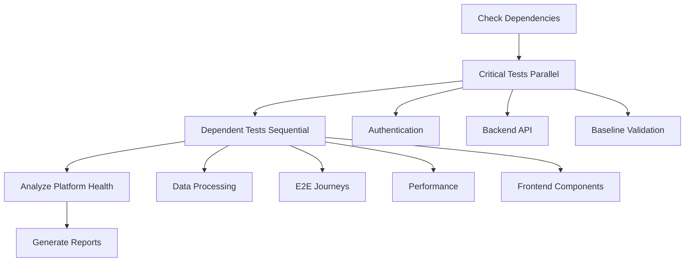

# 🧪 Comprehensive Testing Framework Guide

## Overview

This comprehensive testing framework provides systematic validation of the Orientor Platform across all critical dimensions: authentication, backend APIs, frontend components, data processing, user journeys, performance, and security.

## 🏗️ Testing Architecture

### Test Suite Structure
```
tests/
├── 🎭 master_test_orchestrator.py          # Main orchestration system
├── 🔐 authentication_test_suite.py         # Clerk auth integration testing
├── 🔧 backend_api_test_suite.py            # Prisma API endpoint testing  
├── ⚛️ frontend_component_test_suite.py     # React component analysis
├── 🚀 e2e_user_journey_test_suite.py       # Complete user flow testing
├── ⚡ performance_load_test_suite.py       # Performance & load testing
├── 📊 data_processing_edge_case_test_suite.py # Data safety & edge cases
├── 📋 baseline_validation_suite.py         # Platform health baseline
├── 💾 critical_functionality_test.py       # Core functionality validation
├── 📊 progress_monitor.py                  # Continuous monitoring
└── reports/                                # Generated test reports
```

## 🎯 Testing Categories

### 1. Authentication Testing (`authentication_test_suite.py`)
**Purpose**: Validates Clerk authentication integration and security patterns

**Key Tests**:
- ✅ Clerk backend integration verification
- 🔒 Protected endpoint security validation  
- 📱 Frontend auth pattern analysis
- 🌐 CORS configuration testing
- 🔄 Session management validation
- 🛡️ Security flow analysis

**Success Criteria**:
- All protected endpoints return 401/403 without auth
- Frontend uses proper `useAuth` hooks
- No localStorage token usage detected
- Correct redirect routes (/sign-in vs /login)

### 2. Backend API Testing (`backend_api_test_suite.py`)
**Purpose**: Comprehensive validation of all Prisma endpoints and database operations

**Key Tests**:
- 🔌 Prisma connectivity and model validation
- 🌐 Critical endpoint availability testing
- 📊 Data structure response validation
- ⚡ Performance metrics collection
- 🚫 Error handling pattern verification

**Success Criteria**:
- Prisma client imports successfully
- All critical endpoints return expected responses
- Data structures are consistent and safe
- Response times under acceptable thresholds

### 3. Frontend Component Testing (`frontend_component_test_suite.py`)
**Purpose**: Analyzes React components for safety, performance, and best practices

**Key Tests**:
- 🏗️ Project structure validation
- 🔐 Authentication pattern analysis
- 🚫 Error handling and safety checks
- ⚡ Performance optimization detection
- 📝 TypeScript configuration validation
- 🔨 Build process verification

**Success Criteria**:
- Components use proper Clerk authentication
- Defensive programming patterns implemented
- No forEach errors on undefined arrays
- TypeScript compilation successful

### 4. End-to-End User Journey Testing (`e2e_user_journey_test_suite.py`)
**Purpose**: Validates complete user workflows from frontend to backend

**Key Journeys**:
- 👋 **Onboarding Flow**: Registration → Dashboard → First Assessment
- 📊 **Assessment Completion**: Question Loading → Submission → Results
- 💼 **Career Exploration**: Recommendations → Filtering → Saving
- 🎓 **Education Planning**: Program Discovery → Recommendations
- 💬 **Chat Interaction**: Message Sending → Response Handling

**Success Criteria**:
- All critical user journeys complete successfully
- No broken API integrations
- Proper error handling throughout flows

### 5. Performance & Load Testing (`performance_load_test_suite.py`)
**Purpose**: Ensures platform performs well under various load conditions

**Key Tests**:
- ⚡ Individual endpoint performance benchmarking
- 🏋️ Concurrent user load simulation
- 🧠 Memory usage pattern analysis
- 💪 Stress scenario testing
- 📊 System stability monitoring

**Load Test Scenarios**:
- **Light Load**: 5 users, 10 req/user, 30s
- **Medium Load**: 20 users, 25 req/user, 60s  
- **Heavy Load**: 50 users, 50 req/user, 120s
- **Stress Test**: 100 users, 100 req/user, 180s

**Success Criteria**:
- Average response times < 1000ms
- Error rates < 5% under load
- Memory usage stable
- No server crashes under stress

### 6. Data Processing & Edge Cases (`data_processing_edge_case_test_suite.py`)
**Purpose**: Validates data safety, edge case handling, and defensive programming

**Edge Case Categories**:
- 📭 **Empty Data**: null values, empty strings, empty arrays
- 🔤 **Special Characters**: Unicode, SQL injection, XSS attempts
- 📏 **Size Extremes**: Very long strings, large payloads
- 🔢 **Number Edge Cases**: Zero, negative, floating point precision
- 🔀 **Type Mismatches**: Mixed array types, unexpected structures

**Success Criteria**:
- APIs handle all edge cases gracefully
- No forEach errors on arrays
- Proper input validation and sanitization
- Graceful error responses with useful information

## 🎭 Master Test Orchestrator

The `master_test_orchestrator.py` coordinates all testing suites with intelligent execution planning:

### Execution Strategy
1. **Dependency Validation**: Checks all test files exist
2. **Parallel Execution**: Runs independent critical tests simultaneously
3. **Sequential Execution**: Runs dependent tests after prerequisites pass
4. **Health Analysis**: Aggregates results for platform health assessment
5. **Report Generation**: Creates comprehensive reports in multiple formats

### Execution Flow


## 🚀 Quick Start Guide

### 1. Run Complete Test Suite
```bash
# Run all tests with orchestration
python tests/master_test_orchestrator.py

# View generated reports
open tests/reports/comprehensive_test_report_YYYYMMDD_HHMMSS.html
```

### 2. Run Individual Test Suites
```bash
# Test authentication only
python tests/authentication_test_suite.py

# Test backend APIs only  
python tests/backend_api_test_suite.py

# Test frontend components only
python tests/frontend_component_test_suite.py

# Test user journeys only
python tests/e2e_user_journey_test_suite.py

# Test performance only
python tests/performance_load_test_suite.py

# Test data processing only
python tests/data_processing_edge_case_test_suite.py
```

### 3. Continuous Monitoring
```bash
# Monitor progress during fixes
python tests/progress_monitor.py continuous

# Run baseline validation
python tests/baseline_validation_suite.py

# Test critical functionality
python tests/critical_functionality_test.py
```

## 📊 Understanding Test Results

### Health Grades
- **A (90-100)**: Excellent - Production ready
- **B (80-89)**: Good - Minor improvements recommended
- **C (70-79)**: Fair - Some issues need attention
- **D (60-69)**: Poor - Significant issues present
- **F (0-59)**: Critical - Major problems require immediate attention

### Platform Health Status
- **EXCELLENT**: All systems healthy, production ready
- **GOOD**: Minor issues, largely functional
- **FAIR**: Some components need attention
- **POOR**: Multiple system issues
- **CRITICAL**: Major failures, not production ready

### Exit Codes
- `0`: All tests passed, excellent health
- `1`: Minor issues, good overall health
- `2`: Moderate issues, needs attention
- `3`: Major issues, significant problems
- `4`: Testing framework failure

## 🔧 Troubleshooting Common Issues

### Authentication Issues
```bash
# Check Clerk integration
grep -r "localStorage.getItem.*access_token" frontend/src/
grep -r "router.push('/login')" frontend/src/

# Verify imports
grep -r "import.*useAuth.*@clerk/nextjs" frontend/src/
```

### Backend API Issues
```bash
# Test Prisma connectivity
python -c "from prisma import Prisma; print('✅ Prisma OK')"

# Check server status
curl -I http://localhost:8000/health
curl -I http://localhost:8000/api/v1/hexaco-test/questions
```

### Frontend Component Issues
```bash
# Check TypeScript compilation
cd frontend && npx tsc --noEmit

# Test build process
cd frontend && npm run build
```

### Performance Issues
```bash
# Monitor system resources
top -p $(pgrep -f "python.*main")

# Check memory usage
ps aux | grep python | head -5
```

## 📋 Pre-Deployment Checklist

### Critical Requirements ✅
- [ ] Authentication tests pass (Grade A/B)
- [ ] Backend API tests pass (Grade A/B)  
- [ ] Data processing tests pass (Grade A/B)
- [ ] User journey tests pass (Grade A/B)
- [ ] No critical security issues
- [ ] Platform health score > 80
- [ ] No forEach errors detected
- [ ] All protected endpoints secured

### Recommended Requirements ✅
- [ ] Frontend component tests pass
- [ ] Performance tests pass
- [ ] All edge cases handled gracefully
- [ ] Error boundaries properly implemented
- [ ] TypeScript compilation successful
- [ ] Build process working

### Production Readiness ✅
- [ ] Overall platform health: EXCELLENT or GOOD
- [ ] No critical failures in test orchestration
- [ ] Comprehensive test coverage across all areas
- [ ] Monitoring systems in place
- [ ] Error handling robust
- [ ] User experience validated

## 🔄 Continuous Integration

### Integration with CI/CD
```yaml
# Example GitHub Actions workflow
name: Comprehensive Testing
on: [push, pull_request]
jobs:
  test:
    runs-on: ubuntu-latest
    steps:
      - uses: actions/checkout@v2
      - name: Setup Python
        uses: actions/setup-python@v2
        with:
          python-version: '3.9'
      - name: Install dependencies
        run: pip install -r requirements.txt
      - name: Run comprehensive tests
        run: python tests/master_test_orchestrator.py
      - name: Upload test reports
        uses: actions/upload-artifact@v2
        with:
          name: test-reports
          path: tests/reports/
```

### Automated Monitoring
- Set up daily test runs to catch regressions
- Monitor platform health trends over time
- Alert on critical test failures
- Track performance metrics continuously

## 🎯 Success Metrics

### Quality Indicators
- **Test Coverage**: All critical paths tested
- **Reliability**: Tests consistently pass
- **Performance**: Response times within targets
- **Security**: No vulnerabilities detected
- **User Experience**: Journeys complete successfully

### Platform Readiness
- Authentication system: 100% functional
- Core APIs: All critical endpoints working
- User journeys: All flows completing
- Data safety: No edge case failures
- Performance: Meeting response time targets

This comprehensive testing framework ensures the Orientor Platform meets the highest standards for reliability, security, performance, and user experience before production deployment.